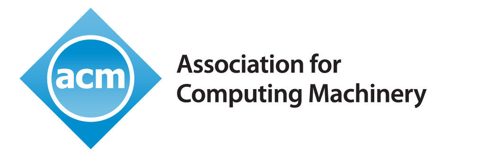

# PPDP 2025

Welcome to the 27th International Symposium on Principles and Practice of
Declarative Programming. PPDP will be co-located with [ICLP
2025](https://iclp25.demacs.unical.it/) and held on 10-11 September 2025 at the
University of Calabria, Rende, Italy.

PPDP is _in cooperation with ACM [SIGLOG](https://siglog.org/)_. 

## Important dates

- Title and abstract registration: 18 May 2025 (AoE)
- Paper submission: 30 May 2025 (AoE)
- Author notification: 7 July 2025
- Final paper version: 21 July 2025

## Overview

The PPDP 2025 symposium brings together researchers from the declarative
programming communities, including those working in the functional, logic,
answer-set, and constraint handling programming paradigms. The goal is to
stimulate research in the use of logical formalisms and methods for analyzing,
performing, specifying, and reasoning about computations, including mechanisms
for concurrency, security, static analysis, and verification.

## Call for Papers
The CFP is available in this [link](./cfp).

## Organization

**Program committee chairs**:  

- [Małgorzata Biernacka](https://ii.uni.wroc.pl//~mabi/) (Institute of Computer Science, University of Wroclaw) 
- [Carlos Olarte](https://sites.google.com/site/carlosolarte/) (University Sorbonne Paris Nord and Laboratoire d'Informatique de Paris Nord). 

**Steering committee chair**: 
- James Cheney (Edinburgh University)

## Program Committee

- Salvador Abreu (University of Évora, Portugal)
- Sandra Alves (University of Porto, Portugal)
- Roman Barták (Charles University, Czech Republic)
- Alessandro Bruni (IT-University of Copenhagen, Denmark)
- Moreno Falaschi (University of Siena, Italy)
- Fabio Gadducci (University of Pisa, Italy)
- Cinzia di Giusto (Université Côte d’Azur, France)
- Michael Hanus (University of Kiel, Germany)
- Thomas Hildebrandt (University of Copenhagen, Denmark)
- Yukiyoshi Kameyama (University of Tsukuba, Japan). 
- Delia Kesner (University Paris Cité, France)
- Cosimo Laneve (University of Bologna, Italy)
- Alberto Momigliano (University of Milan, Italy)
- Ruben Rubio (Universidad Complutense de Madrid, Spain)
- Claudio Sacerdoti Coen (University of Bologna, Italy)
- Filip Sieczkowski (Heriot-Watt University, UK)
- Bernardo Toninho (NOVA FCT and NOVA LINCS, Portugal)
- Frank Valencia (LIX, École Polytechnique de Paris, France)
- Germán Vidal (Universitat Politecnica de Valencia, Spain)

